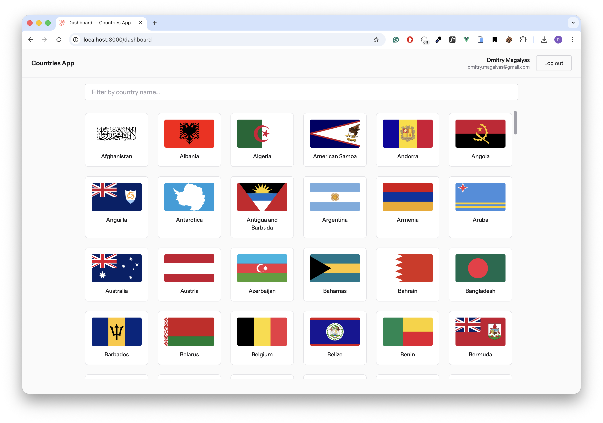

# Countries App



## Tech Stack

- **Backend:** Laravel 12, PHP 8.5
- **Frontend:** Vue 3, Tailwind CSS
- **Auth:** Auth0
- **Infrastructure:** Docker, Nginx, PHP-FPM

## How It Works

This is a hybrid application: Laravel serves the pages and the API, Vue handles the UI on the client side.

After login, the app fetches countries from the [REST Countries API](https://restcountries.com/) and displays them in a grid with flags. Results are cached server-side to avoid hitting the external API on every request.

The data source is abstracted behind a `CountryDataSource` interface, so replacing it with a different provider only requires a new implementation class. Data between layers is passed as a `CountryDto`, keeping the internal structure independent from the external API response.

## Future Possible Improvements

- **Redis** for cache and sessions to support horizontal scaling.
- **Decouple frontend and backend into separate repos** independent deployment pipelines, Bearer token auth, and the API becomes open to mobile or third-party clients.
- **Cache warming** via a scheduled Artisan command to avoid slow first requests after cache expiry.
- **Fallback provider** if the primary API goes down. Easy to add given the `CountryDataSource` interface.


## Setup

### 1. Clone the repository

```bash
git clone git@github.com:dd3v/countries-app.git
cd countries-app
```

### 2. Configure environment

```bash
cp .env.example .env
```

Fill in the Auth0 credentials (see [Auth0 Setup](#auth0-setup) below).

The cache behaviour:

| Variable | Default | Description |
|---|---|---|
| `COUNTRIES_CACHE_KEY` | `countries:all` | Cache key used to store the countries list |
| `COUNTRIES_CACHE_TTL` | `3600` | Cache lifetime in seconds |

### 3. Run the app

**Development** (hot reload, source mounted as volume):

```bash
docker compose -f docker-compose.dev.yml up --build
```

Open [http://localhost:8000](http://localhost:8000) in your browser.

## Auth0 Setup

You need a free Auth0 account to enable authentication.

### 1. Create an Auth0 account

Go to [auth0.com](https://auth0.com) and sign up for free.

### 2. Create an application

In the Auth0 Dashboard: **Applications -> Create Application -> Regular Web Application**.

Open the app settings and set these URLs:

| Field | Value |
|---|---|
| Allowed Callback URLs | `http://localhost:8000/callback` |
| Allowed Logout URLs | `http://localhost:8000` |


### 3. Create an API

In the Auth0 Dashboard: **Applications -> APIs -> Create API**.

Set any name (e.g. `Countries App API`) and an identifier (e.g. `http://countries-app/api`). The identifier will be used as `AUTH0_AUDIENCE`.

### 4. Fill in `.env`

Copy the values from your application and API settings:

```env
AUTH0_DOMAIN=your-tenant.auth0.com
AUTH0_CLIENT_ID=your-client-id
AUTH0_CLIENT_SECRET=your-client-secret
AUTH0_AUDIENCE=http://countries-app/api
```

## API

The backend implements an internal API consumed by the Vue frontend. It is documented in [`openapi.yaml`](./openapi.yaml) (OpenAPI 3.1).

| Method | Path | Auth | Description |
|---|---|---|---|
| `GET` | `/api/countries` | session | Returns a list of all countries with flag URLs |

## Commands

**Format code (PHP):**
```bash
composer format
```

**Lint / format (JS/Vue):**
```bash
npm run lint
npm run format
```
